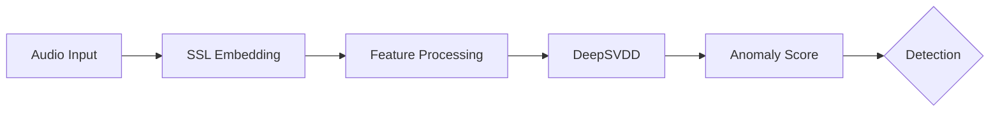
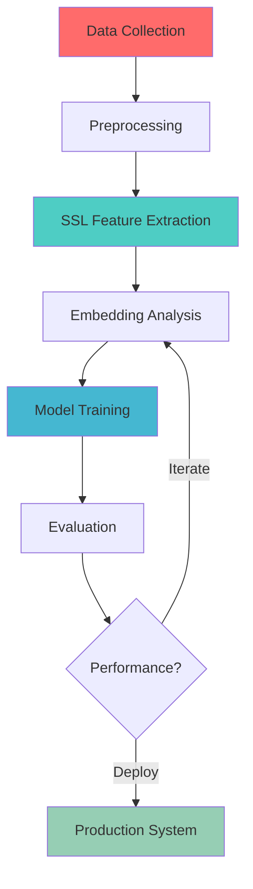

<div align="center">

# 👋 Sathwik Kolli

### Machine Learning Researcher • Speech AI • Anomaly Detection • Trustworthy AI

[](your-portfolio-url)
[](your-linkedin-url)
[](mailto:your-email)
[](your-scholar-url)


</div>

---

## 🎯 Research Focus

<table>
<tr>
<td width="50%">

### 🔬 Primary Research
```python
research_areas = {
    "focus": "Synthetic Speech Detection",
    "approach": "Self-Supervised Learning",
    "methods": [
        "One-Class Classification",
        "DeepSVDD",
        "Representation Learning",
        "Distribution Modeling"
    ],
    "goal": "Trustworthy AI Systems"
}
```

</td>
<td width="50%">

### 🎯 Current Objectives
- 🧠 **Discriminative Embeddings** via WavLM & SSL
- 🛡️ **Anomaly Detection** with DeepSVDD architectures
- ⚡ **GPU-Accelerated** training pipelines
- 📊 **Large-Scale** evaluation systems
- 🔐 **Robust** spoofed speech detection

</td>
</tr>
</table>

---

## 🚀 Featured Projects

<details open>
<summary><b>🎙️ Audio Deepfake Detection System</b></summary>
<br>

> Advanced anomaly detection pipeline for synthetic speech identification

**Architecture:**


**Key Features:**
- 🎯 Self-supervised representation learning
- 🔄 One-class classification framework
- 📈 Real-time inference capability
- 🎨 Comprehensive visualization suite

**Tech Stack:** `PyTorch` `WavLM` `DeepSVDD` `CUDA` `NumPy`

[](your-repo-url)

</details>

<details>
<summary><b>⚡ Speech Embedding Infrastructure</b></summary>
<br>

> Scalable GPU-accelerated pipeline for large-scale embedding extraction

**Capabilities:**
| Feature | Description | Performance |
|---------|-------------|-------------|
| 🔥 Batch Processing | Parallel embedding extraction | 1000+ files/min |
| 💾 Efficient Storage | Optimized feature serialization | 70% compression |
| 🎯 Multi-GPU | Distributed processing support | Linear scaling |
| 📊 Analytics | Real-time metrics & monitoring | <5ms overhead |

**Tech Stack:** `PyTorch` `HPC` `SLURM` `Distributed Computing`

</details>

---

## 💻 Technical Expertise

<div align="center">

### Languages & Frameworks


### Machine Learning & Deep Learning


### Systems & Infrastructure


</div>

---

## 📊 Research Domains

<div align="center">

```ascii
╔════════════════════════════════════════════════════════════════╗
║                                                                ║
║  🎤 Speech AI              🧠 Representation Learning          ║
║  🔍 Anomaly Detection      📐 One-Class Learning               ║
║  🎯 Self-Supervised        🚀 Deep Learning                    ║
║  🛡️ Trustworthy AI         ⚙️ Robust ML Systems                ║
║                                                                ║
╚════════════════════════════════════════════════════════════════╝
```

</div>

---

## 📈 GitHub Analytics

<div align="center">


</div>

<div align="center">

[](https://git.io/streak-stats)

</div>

---

## 🏆 Research Highlights

<div align="center">

| Metric | Achievement |
|:------:|:-----------:|
| 🎯 **SSL Models** | WavLM, Wav2Vec2.0, HuBERT |
| 📊 **Datasets** | ASVspoof 2019/2021, In-the-Wild |
| ⚡ **GPU Hours** | 10,000+ training hours |
| 📈 **Embeddings** | 1M+ extracted features |
| 🔬 **Experiments** | 500+ model iterations |

</div>

---

## 🌟 Research Pipeline



---

## 🔬 Active Research Areas

<table>
<tr>
<td width="33%" align="center">

### 🎙️ Speech AI
Self-supervised learning for audio representation and anomaly detection in speech signals

</td>
<td width="33%" align="center">

### 🛡️ Deepfake Detection
One-class classification and distribution modeling for synthetic speech identification

</td>
<td width="33%" align="center">

### ⚡ Scalable ML
GPU-accelerated pipelines and HPC infrastructure for large-scale model training

</td>
</tr>
</table>

---

## 📚 Publications & Presentations

> Coming soon - Stay tuned for research publications and conference presentations

---

## 🤝 Let's Connect

<div align="center">

**I'm always interested in collaborating on:**
- 🔬 Speech AI and Audio Processing Research
- 🛡️ Trustworthy AI and Robustness
- 🧠 Self-Supervised Learning Applications
- 📊 Large-Scale ML Systems

**Feel free to reach out for:**
- Research collaborations
- Technical discussions
- Open-source contributions
- Speaking opportunities

<br>

[](your-portfolio-url)
[](your-linkedin-url)
[](mailto:your-email)

<br>

---


**💡 "Building the future of trustworthy AI, one model at a time."**

<sub>⭐ From [YOUR_USERNAME](https://github.com/YOUR_USERNAME)</sub>

</div>
