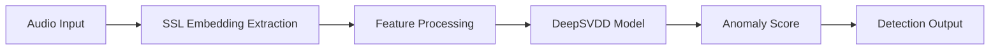

# 👋 Sathwik Kolli

### Machine Learning Researcher • Speech AI • Anomaly Detection • Trustworthy AI

---

## 🎯 Research Focus

<table>
<tr>
<td width="50%">

### 🔬 Primary Research

**Focus:** Synthetic Speech and Audio Deepfake Detection  
**Approach:** Self-Supervised Representation Learning  
**Methods:**

- One-Class Classification  
- DeepSVDD and centroid-based models  
- Representation learning using SSL embeddings  
- Distribution modeling and anomaly scoring  

**Objective:** Building reliable and trustworthy AI systems  

</td>

<td width="50%">

### 🎯 Current Objectives

- 🧠 Learning discriminative embeddings using WavLM and SSL models  
- 🛡️ Developing DeepSVDD-based anomaly detection systems  
- ⚡ Building GPU-accelerated ML pipelines using PyTorch  
- 📊 Evaluating models on large-scale speech datasets  
- 🔐 Improving robustness against synthetic and spoofed speech  

</td>
</tr>
</table>

---

## 🚀 Featured Projects

<b>🎙️ Audio Deepfake Detection System</b>

 

Advanced anomaly detection pipeline for identifying synthetic speech using self-supervised embeddings.

**Architecture Overview:**

**Key Features:**

- Self-supervised representation learning
- One-class anomaly detection framework
- GPU-accelerated training and inference
- Scalable feature extraction pipeline

**Tech Stack:** PyTorch • WavLM • DeepSVDD • CUDA • NumPy

<b>⚡ Speech Embedding Infrastructure</b>

 

Scalable GPU pipeline for extracting and processing speech embeddings.

**Capabilities:**

| Feature | Description |
|---------|-------------|
| GPU Processing | Accelerated embedding extraction |
| Large-scale Data | Efficient handling of speech datasets |
| Feature Engineering | Optimized embedding pipelines |
| Model Integration | Direct integration with ML models |

**Tech Stack:** PyTorch • Linux • CUDA • HPC

---

## 💻 Technical Expertise

### Programming Languages

### Machine Learning and AI

### Systems and Infrastructure

---

## 🐍 Contribution Snake

---

## 📊 GitHub Analytics

 

 

---

## 🔬 Active Research Areas

<table>
<tr>
<td width="33%" align="center">

### 🎙️ Speech AI

Self-supervised learning and representation learning for speech analysis

</td>
<td width="33%" align="center">

### 🛡️ Deepfake Detection

Anomaly detection using one-class classification and embedding models

</td>
<td width="33%" align="center">

### ⚡ Scalable ML Systems

GPU-accelerated training pipelines and large-scale ML infrastructure

</td>
</tr>
</table>

---

## 🤝 Connect with Me

 

**Building reliable and scalable machine learning systems through research and engineering.**

